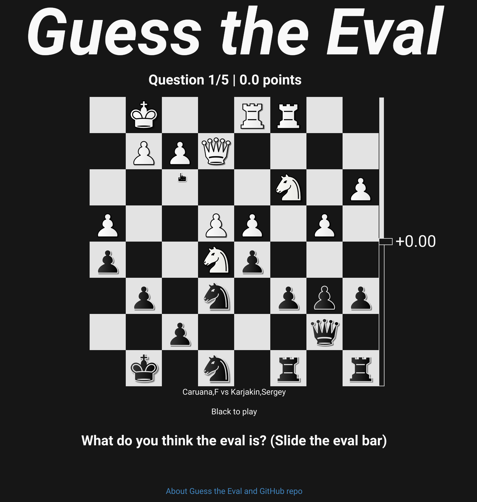
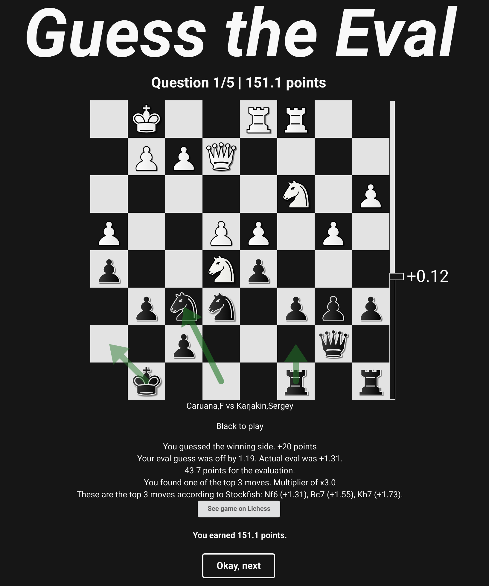

# Guess the Eval

[Guess the Eval](https://makotoe.github.io/guess-the-eval/) presents a series of chess positions, and you have to guess what evaluation Stockfish gives to those positions. If you guess one of the top three moves from the position, you may get a multiplier applied to your score.

The TypeScript project for the web app is located at the root of this repo. The Rust-based `evaluator` which is responsible for selecting positions and calculating evals is located under [`evaluator`](evaluator).
